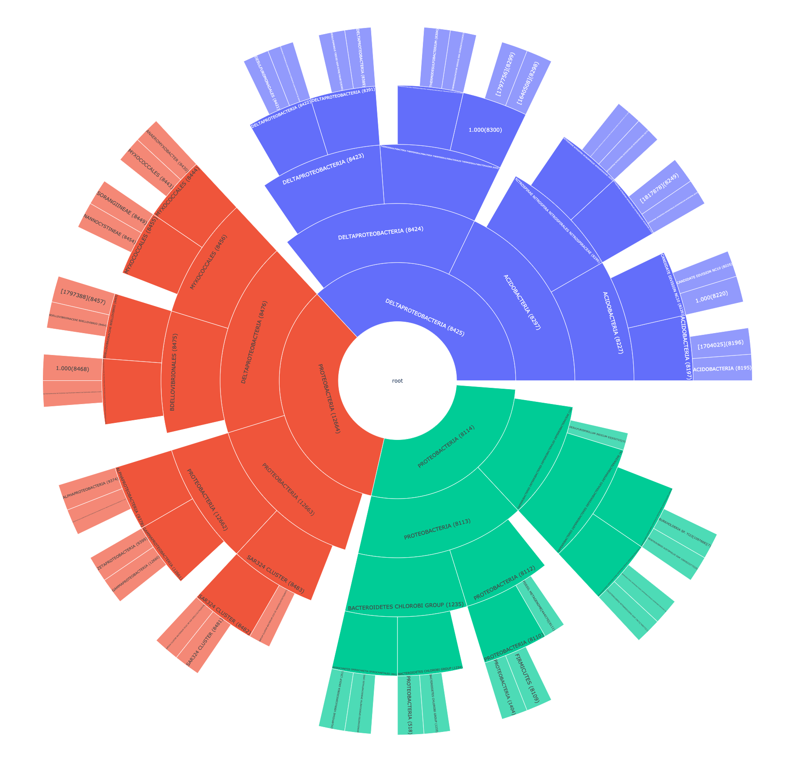
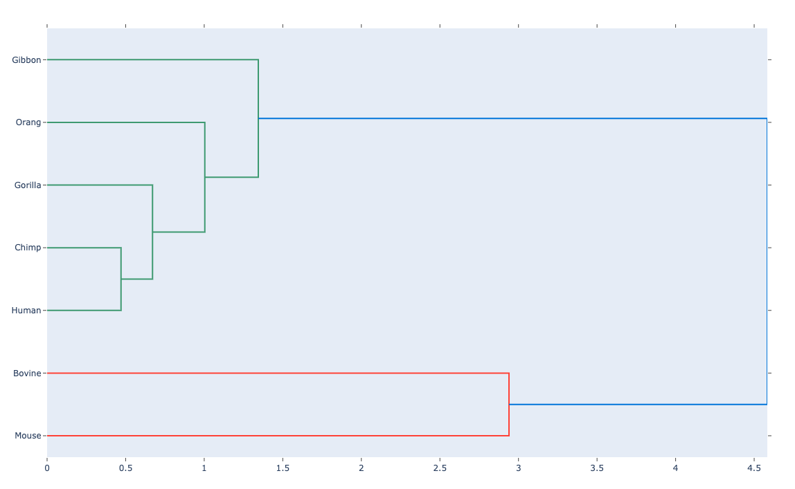

# Metagenomics Final - Phylogenetics Visualization
Course: 410.734

Name: Emily Tran [ttran66]

Date: 12/14/2020

- [Metagenomics Final - Phylogenetics Visualization](#metagenomics-final---phylogenetics-visualization)
  - [Project Goal](#project-goal)
  - [1: PhyloSift](#1-phylosift)
    - [Installation](#installation)
    - [Sample Metageome](#sample-metageome)
  - [2: Data Format Conversion](#2-data-format-conversion)
    - [Python Dependency Installation](#python-dependency-installation)
    - [File Format Conversion](#file-format-conversion)
  - [3: Graph Generation](#3-graph-generation)
    - [phyloXML Plotly](#phyloxml-plotly)
    - [Newick to Plotly Dendrogram](#newick-to-plotly-dendrogram)
  - [Demo Notes](#demo-notes)

## Project Goal
* This project is focused on visualizations for phylogenetic trees, going through the following steps:
    1. The setup and usage of a tool that takes in a metagenome sample and produces phylogenies in a structured output format
    2. Conversion of the output into a form usable by graphing/plotting libraries
    3. Scripts that can generate two types of graphs: denodrgrams and sunburst (hierarchy) plots

PhyloSift will be used to process a metagenomic sample and generate a phyloXML output to be converted. While there are several tools out there that do process phyloXML already ([archaeopteryx](http://www.phylosoft.org/archaeopteryx/) being one of the most popular chocies), these tend to be specialized phylogeny tools. I hope to convert more standard biological formats into something more generic that can be used by general purpose plotting or graphing libraries. The two main plotting libraries I will examine are Plotly and D3.js, linked below.

1. [Plotly](https://plotly.com/)
2. [D3.js](https://d3js.org/):
   1.  demo codes were based off examples from [https://observablehq.com/@d3/gallery](https://observablehq.com/@d3/gallery)

---

## 1: PhyloSift
* phylosift: https://figshare.com/articles/PhyloSift_markers_database/5755404
    - GitHub: https://github.com/gjospin/PhyloSift
    - PhyloSiftt API and usage documentation: https://phylosift.wordpress.com/tutorials/running-phylosift/phylosift-overview/
* *Note*: the URL cited in the GitHub link is outdated, while the figshare link is more recent and works as 12/2020

### Installation

*Warning*: These PhyloSift binaries were built targeting a 32-bit operating system, which means it will not work on the latest Mac OS X 15.7 (Catalina) build.

1. Download the **figshare** archive directly from a browser (downloads as `5755404.zip`) or via command line, like so:

        # make directory to hold phylosift executables and markers/NCBI DB
        mkdir <phylosift-root>
        cd <phylosift-root>

        # Linux or Ubuntu
        wget -O phylosift.zip https://ndownloader.figshare.com/articles/5755404/versions/4

        # Mac OS X
        curl https://ndownloader.figshare.com/articles/5755404/versions/4 -o phylosift.zip

2. the archive should be unzipped, using the following command:
        
        # on Linux or Ubuntu, you may need to install the unzip utility first
        sudo apt install unzip
        unzip phylosift.zip 
 
3.  unzipped file will extract 4 tar archives within it:
    1. `phylosift_v1.0.1.tar.bz2`
    2. `markers_20140913.tgz` - older version of the target markers from the v1.0 of PhyloSift
    3. `markers.tgz` - this is the latest version of the markers from 2018, so this should be unpacked
    4. `ncbi.tgz`

            # extract *.tgz files using following command
            tar -xf <filename>

            # extract *.bz2 file using following command
            tar -xjf phylosift_v1.0.1.tar.bz2

4. copy and unzip files 1, 3, 4 from above into a directory which we will refer to as `<phylosift-root>`, so our file structure will look like:

        <phylosift-root>/
        |-- phylosift_v1.0.1/
        |   |--- bin/
        |   |--- phylosiftrc
        |   |--- PS_temp
        |   |   |--- <metagenome-filename-prefix>/
        |   |   |   |--- <metagenome-filename-prefix>.xml - this is where the phyloXML output which we can use is located
        |-- markers/
        |-- ncbi/

        You must run PhyloSift directly from its file location, rather than adding it to global $PATH

        The metagenome-file-name-prefix value is automatically based off the name of the input FASTA/FASTQ file passed into the PhyloSift run

5. navigate to `<phylosift-root>/phylosift_v1.0.1`
6. modify the configuration file `phylosiftrc`, lines 43 - 47:

        # modifying this ensures that PhyloSift will the local NCBI database and markers archive from step 2, rather than trying to load them over the web
        $marker_dir= "<phylosift-root>/markers";
        $markers_extended_dir="";
        $ncbi_dir = "<phylosift-root>/ncbi";
        $marker_base_url = "";
        $ncbi_url = "";

7. PhyloSift comes with sample data that can be used to test it, which takes about 30 minutes:
  
        # outputs to  <phylosift-root>/phylosift_v1.0.1/PS_temp/HMP_1.fastq.gz/
        # more details on files are at phylosift: https://phylosift.wordpress.com/tutorials/phylosift-outputs/
        cd <phylosift-root>/phylosift_v1.0.1
        ./phylosift all --paired tutorial_data/HMP_1.fastq.gz tutorial_data/HMP_2.fastq.gz

8. Debugging: if you had failed runs, PhyloSift won't re-run unless you clear out the partial output from PS_temp:

        rm -rf PS_temp/**

### Sample Metageome
* Metagenome: [sample *fa](https://portal.hmpdacc.org/files/54a24ca84a57a7d5b06687939f620d69)
   - Throat/Gingiva sample from Human Microbiome Project
   - Download link: [	https://downloads.hmpdacc.org/dacc/hhs/genome/microbiome/wgs/analysis/hmbsa/v1/Throat.tar.bz2]()

---

## 2: Data Format Conversion 

* Python3 and its module manager *pip3* are required

### Python Dependency Installation

        pip3 install numpy
        pip3 install pandas
        pip3 install plotly
        pip3 install xmldtodict

        # ete3 and PyQt5 are used for calculating distance matrix when converting newick format to a format for Plotly denodrogram
        pip3 install PyQt5
        pip3 install ete3

### File Format Conversion

* `convert_phylo_xml.py` script has the following arguments:

        > ./convert_phylo_xml.py --help                                                                                                       
                usage: convert_phylo_xml.py [-h] -i INPUT [-o OUTPUT] -p PLOTTYPE
                                        [-d MAXDEPTH]

                Converts a phyloXML file to nested JSON (D3.js) or flat arrays (Plotly)

                optional arguments:
                -h, --help            show this help message and exit
                -i INPUT, --input INPUT
                                        phyloXML file path, must be XML
                -o OUTPUT, --output OUTPUT
                                        output file name, e.g. test.json or plotly.out
                -p PLOTTYPE, --plot-type PLOTTYPE
                                        which plot library format to conver to, options =
                                        [plotly, d3]
                -d MAXDEPTH, --max-depth MAXDEPTH
                                        max depth of the output JSON file, default = 5, -1 =
                                        no maximum

* phyloXML to Plotly format
        
         ./convert_phylo_xml.py -i demo-input-files/phylo-test.xml -p plotly  -d 5 

        Writing out Plotly arrays to: demo-input-files/phylo-test.out

* phyloXML to JSON/D3-compatible format

        ./convert_phylo_xml.py -i demo-input-files/phylo-test.xml -p d3 -d 5

        Writing out json to: demo-input-files/phylo-test.json

---

## 3: Graph Generation

### phyloXML Plotly
* takes in output from `convert_phylo_xml.py`, outputs to Plotly sunburst graph

        > ./plotly_phylo.py --help 
                usage: plotly_phylo.py [-h] -i INPUT [-o OUTPUT]

                Generate a Plotly sunburst graph as HTML

                optional arguments:
                -h, --help            show this help message and exit
                -i INPUT, --input INPUT
                                        plotly input file path, output from the
                                        convert_phylo_xml script
                -o OUTPUT, --output OUTPUT
                                        plotly output HTML file path

* example run:
        
        ./plotly_phylo.py -i demo-input-files/phylo-test.out -o demo-input-files/plotly-phylo.html

        Saving sunburst diagram to: demo-input-files/plotly-phylo.html

* example sunburst diagram, exported as PNG:

### Newick to Plotly Dendrogram
* works directly without a conversion script

        > ./plotly_newick.py --help
                usage: plotly_newick.py [-h] -i INPUT -o OUTPUT

                Generate a Plotly sunburst graph as HTML

                optional arguments:
                -h, --help            show this help message and exit
                -i INPUT, --input INPUT
                                        plotly input file path, output from the
                                        convert_phylo_xml script
                -o OUTPUT, --output OUTPUT
                                        plotly output HTML file path

* example run 1, using specific output file:

        ./plotly_newick.py -i demo-input-files/newick-sample.txt -o demo-input-files/newick.html

* example run 2, using defualt output file:
        
        ./plotly_newick.py -i demo-input-files/life.txt

        Saving dendrogram diagram to: plotly-demo/life.txt.html

* example dendrogram, exported as PNG:

---

## Demo Notes

* This will be deployed to Google Cloud VM for grading, the D3 demo will be served to `<VM Instance IP>`:8000:
  
  - the VM IP changes upon suspension and resume, so please email me at ttran@jh.edu if there are issues
  - the VM contains PhyloSift installation in the home directory, for use if desired
  - this repository is cloned to the VM in the home directory, with the demo being served for the D3 graphs, from `d3-demo/`
  - the D3 demo files expects the JSON file to be named `test.json`, which is hard-coded in the JavaScript files

* Since the VMs are headless we cannot open the Plotly HTML figures generated, but the examples are served as part of the demo above, just unlinked. They were not integrated into the D3 demo since I wanted to preserve the Plotly HTML output as it was generated by the library. They will be available at:

  -  `<VM Instance IP>`:8000/life.html
  -  `<VM Instance IP>`:8000/plotly-newick.html
  -  `<VM Instance IP>`:8000/plotly-sunburst.html